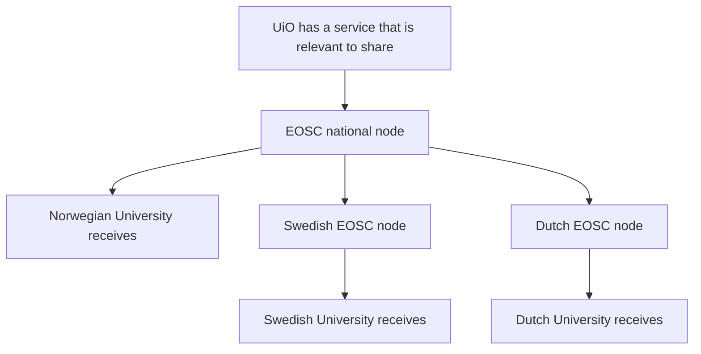
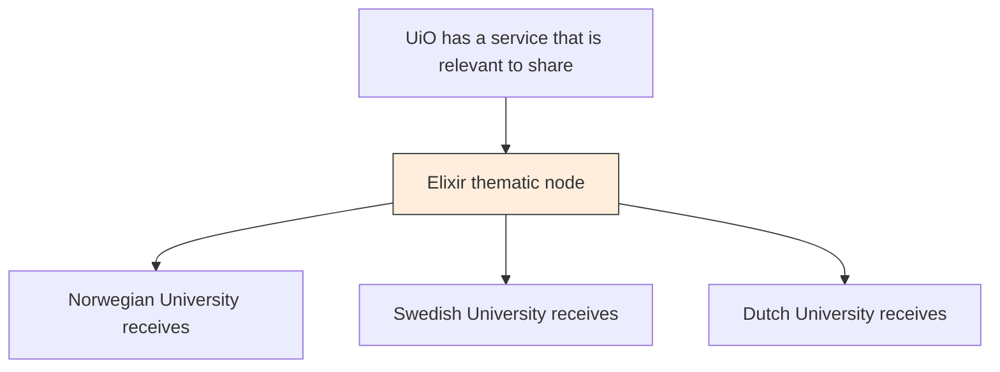

# Services

[← Back to main document](index.md)

## Service Sharing

### Sharing a Service That Is Not Part of a Thematic Node

The following diagram illustrates how a service developed by a Norwegian university f.ex. UiO (University of Oslo) that is not part of a thematic node can be shared through the Norwegian EOSC node to both national and international recipients:

### Sharing a Service That Is Part of a Thematic Node

When a service is already part of a thematic node (like Elixir), it can be shared directly through that node:

In this scenario, the EOSC national node is not involved in the service distribution, as the thematic node (Elixir) handles the coordination directly.

> **Discussion:** See [Issue x](link)